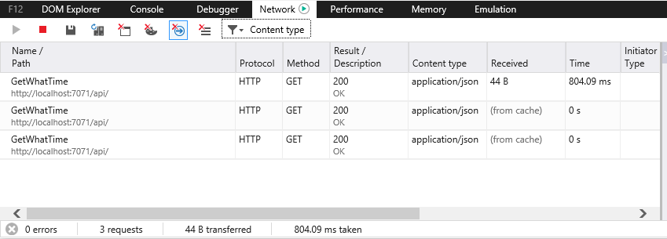

# IE is caching your function

Hi my name is Barranger, and I hate Internet Explorer.

Now that we have that out of the way, let me describe to you the 2345678th reason for this hatred, by explaining what IE is doing with requests to your fancy new `HttpTrigger`-ed Azure Function (a waaaaaay less fancy function we'll use for this post [can be found here](https://github.com/barranger/iecache)): it's caching it, even though there are not a caching header to be found.

If you look at the source code at the link you'll see I've created both a simple Azure Function as well as an extremely simple html file that will invoke the function, when they're both running it will look something like this:

 

*(please stop with all the offers for my design work, I know it's beautiful)*

If you click the refresh button over and over again you'll see that it updates as you'd expect in both Chrome and Firefox.  If you try it in IE however it will always stay the same, and a quick peak at the developer tools will show you why:



That's right even though no caching headers have been found, IE has decided that it's going to cache the value and just reuse it every time.  

Luckily there's a pretty easy fix for this:

```c#
req.HttpContext.Response.Headers.Add("Cache-Control", "no-cache");
```

in your `HttpTrigger`-ed function and you've removed one of the many issues that IE will cause you:


This may not be the cleanest way of dealing with the issue, but when it comes to IE, when is it ever clean.  If you know of a better way, let me know in the comments bellow.